# 🛡️ CyberSafe Nexus - Complete System Design Documentation

## 📊 Table of Contents
1. [Data Flow Diagrams (Level 0 & 1)](#data-flow-diagrams)
2. [Class Diagram](#class-diagram)
3. [Entity Relationship Diagram](#entity-relationship-diagram)
4. [Use Case Diagram](#use-case-diagram)
5. [Sequence Diagrams](#sequence-diagrams)
6. [Activity Diagrams](#activity-diagrams)
7. [Data Dictionary](#data-dictionary)

---

## 📈 Data Flow Diagrams (Level 0 & 1)

### Level 0 DFD - Context Diagram
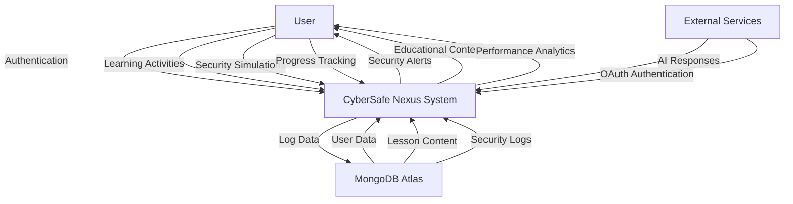

### Level 1 DFD - System Decomposition
```mermaid
graph TD
    subgraph "CyberSafe Nexus System"
        subgraph "Authentication Module"
            A1[Login Process]
            A2[Google OAuth]
            A3[Registration]
            A4[Password Recovery]
        end
        
        subgraph "Learning Module"
            L1[Lesson Management]
            L2[Quiz Generation]
            L3[Progress Tracking]
            L4[Leaderboard System]
        end
        
        subgraph "Security Tools Module"
            S1[Phishing Analyzer]
            S2[SQLi Playground]
            S3[Password Auditor]
            S4[SIEM Logger]
        end
        
        subgraph "AI Assistant Module"
            AI1[Query Processing]
            AI2[Context Analysis]
            AI3[Response Generation]
        end
        
        subgraph "Admin Module"
            AD1[User Management]
            AD2[System Monitoring]
            AD3[Global Analytics]
            AD4[Broadcast System]
        end
    end
    
    U[User] --> A1
    U --> A2
    U --> A3
    U --> A4
    
    U --> L1
    U --> L2
    U --> L3
    U --> L4
    
    U --> S1
    U --> S2
    U --> S3
    
    U --> AI1
    
    ADMIN[Admin] --> AD1
    ADMIN --> AD2
    ADMIN --> AD3
    ADMIN --> AD4
    
    GEMINI[Google Gemini AI] --> AI3
    GOOGLE[Google OAuth] --> A2
    
    DB[(MongoDB Atlas)] --> A1
    DB --> A3
    DB --> L1
    DB --> L3
    DB --> L4
    DB --> S4
    DB --> AD1
    DB --> AD3
```

---

## 🏗️ Class Diagram

```mermaid
classDiagram
    class User {
        +String userId
        +String name
        +String email
        +String passwordHash
        +String role
        +Integer xp
        +Array completedLessons
        +Integer dailyStreak
        +String organization
        +String profilePicture
        +DateTime createdAt
        +DateTime lastLogin
        
        +login(email, password)
        +register(userData)
        +updateProfile(profileData)
        +getProgress()
        +addXp(amount)
    }
    
    class Lesson {
        +String lessonId
        +String title
        +String content
        +String difficulty
        +Array prerequisites
        +Integer estimatedTime
        +Array learningObjectives
        +Boolean isActive
        
        +getContent()
        +getPrerequisites()
        +isCompleted(userId)
        +generateQuiz()
    }
    
    class Quiz {
        +String quizId
        +String lessonId
        +Array questions
        +Integer passingScore
        +DateTime createdAt
        +Integer timeLimit
        
        +generateQuestions(lessonContent)
        +submitAnswers(userId, answers)
        +calculateScore(answers)
    }
    
    class SecurityTool {
        +String toolId
        +String toolName
        +String toolType
        +String description
        +Array parameters
        
        +execute(input)
        +validateInput(input)
        +logUsage(userId, result)
    }
    
    class SecurityLog {
        +String logId
        +String userId
        +String toolName
        +String inputData
        +String riskLevel
        +String resultSummary
        +DateTime timestamp
        +String ipAddress
        
        +createLog(userId, toolData)
        +redactPII(data)
        +getLogsByUser(userId)
        +getLogsByTool(toolName)
    }
    
    class AIAssistant {
        +String sessionId
        +String userId
        +Array conversationHistory
        +String currentContext
        +DateTime lastInteraction
        
        +processQuery(query, context)
        +generateResponse(query, context)
        +updateContext(newContext)
        +getConversationHistory()
    }
    
    class AdminPanel {
        +String adminId
        +Array systemMetrics
        +Array userAnalytics
        +Array securityAlerts
        +Array globalSettings
        
        +getAllUsers()
        +getSystemHealth()
        +generateAnalytics()
        +pushGlobalAlert(message)
        +resetSystem()
    }
    
    class AuthenticationToken {
        +String tokenId
        +String userId
        +DateTime issuedAt
        +DateTime expiresAt
        +String tokenType
        +Boolean isActive
        
        +generateToken(userId)
        +validateToken(token)
        +refreshToken(oldToken)
        +revokeToken(tokenId)
    }
    
    class Leaderboard {
        +String leaderboardId
        +Array entries
        +String category
        +DateTime lastUpdated
        +Integer maxEntries
        
        +updateRankings()
        +getTopUsers(limit)
        +getUserRank(userId)
        +addEntry(userId, score)
    }
    
    %% Relationships
    User ||--o{ Lesson : completes
    User ||--o{ Quiz : takes
    User ||--o{ SecurityLog : generates
    User ||--o{ AIAssistant : interacts
    User ||--o{ AuthenticationToken : holds
    User ||--o{ Leaderboard : appears_in
    
    Lesson ||--o{ Quiz : contains
    SecurityTool ||--o{ SecurityLog : creates
    
    AdminPanel ||--o{ User : manages
    AdminPanel ||--o{ SecurityLog : monitors
    AdminPanel ||--o{ Leaderboard : maintains
```

---

## 🗄️ Entity Relationship Diagram

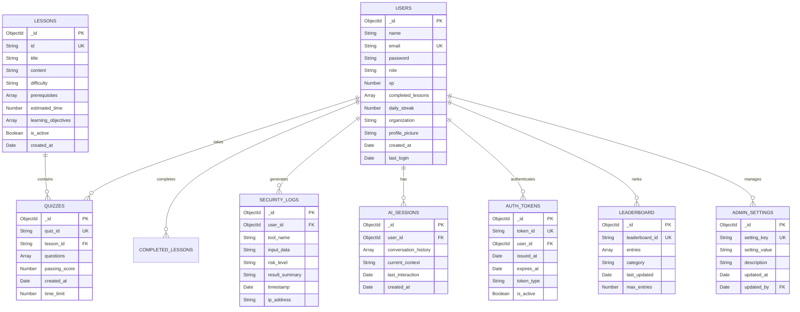

---

## 🎯 Use Case Diagram

```mermaid
graph TD
    subgraph "User Roles"
        U[Student/Cadet]
        A[Administrator]
        I[Instructor]
    end
    
    subgraph "Authentication Use Cases"
        UC1[Register Account]
        UC2[Login with Email]
        UC3[Login with Google]
        UC4[Reset Password]
        UC5[Update Profile]
        UC6[Logout]
    end
    
    subgraph "Learning Use Cases"
        UC7[Browse Lessons]
        UC8[View Lesson Content]
        UC9[Take Quiz]
        UC10[Track Progress]
        UC11[View Leaderboard]
        UC12[Earn Certificates]
    end
    
    subgraph "Security Tools Use Cases"
        UC13[Analyze Phishing URL]
        UC14[Practice SQL Injection]
        UC15[Audit Password Strength]
        UC16[View Security Logs]
    end
    
    subgraph "AI Assistant Use Cases"
        UC17[Ask Security Questions]
        UC18[Get Learning Guidance]
        UC19[Receive Context Help]
    end
    
    subgraph "Admin Use Cases"
        UC20[Manage Users]
        UC21[Monitor System Health]
        UC22[Generate Analytics]
        UC23[Push Global Alerts]
        UC24[Reset System]
        UC25[Manage Content]
    end
    
    %% Actor Relationships
    U --> UC1
    U --> UC2
    U --> UC3
    U --> UC4
    U --> UC5
    U --> UC6
    
    U --> UC7
    U --> UC8
    U --> UC9
    U --> UC10
    U --> UC11
    U --> UC12
    
    U --> UC13
    U --> UC14
    U --> UC15
    U --> UC16
    
    U --> UC17
    U --> UC18
    U --> UC19
    
    A --> UC20
    A --> UC21
    A --> UC22
    A --> UC23
    A --> UC24
    A --> UC25
    
    I --> UC7
    I --> UC8
    I --> UC9
    I --> UC10
    I --> UC11
```

---

## 🔄 Sequence Diagrams

### 1. User Authentication Sequence
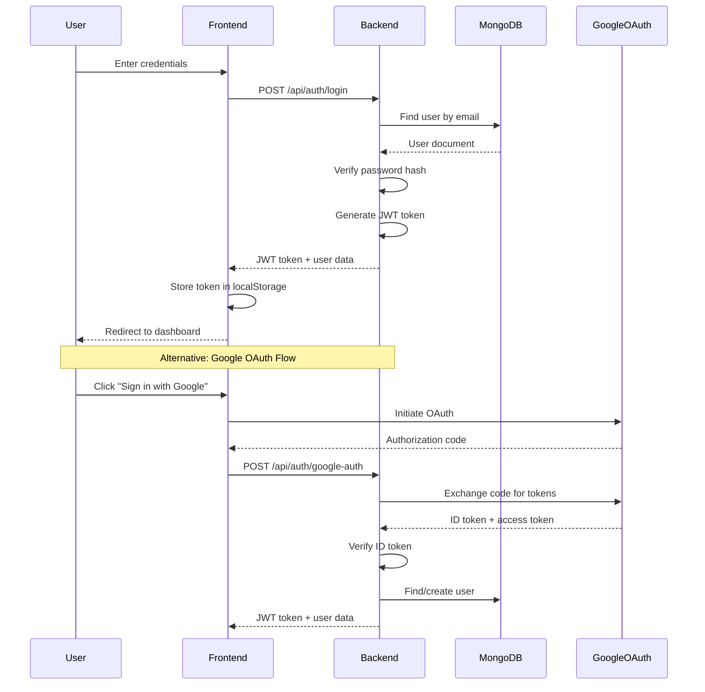

### 2. Lesson Learning Sequence
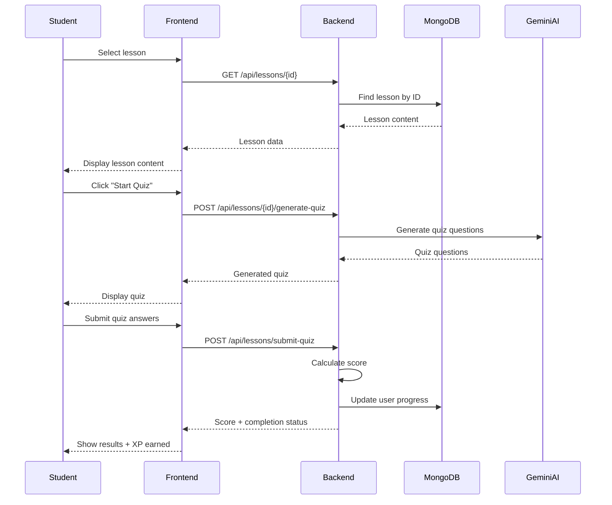

### 3. Security Tool Analysis Sequence
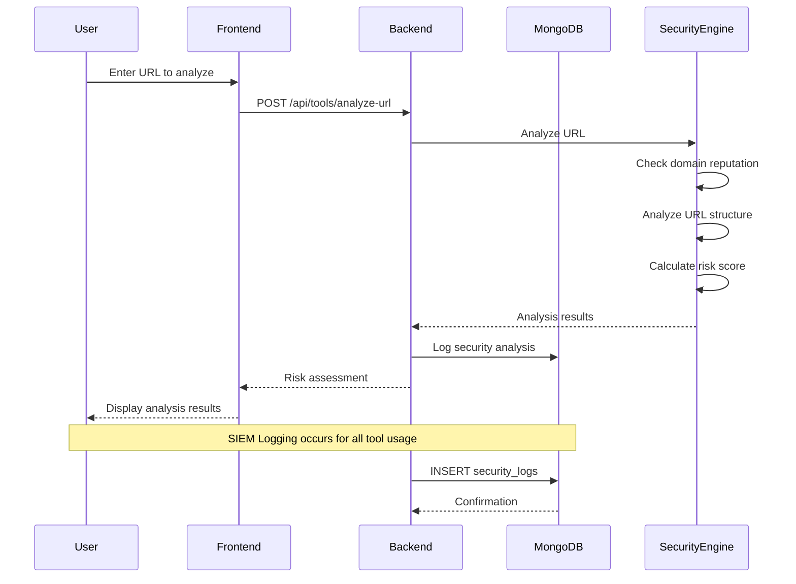

### 4. AI Assistant Interaction Sequence
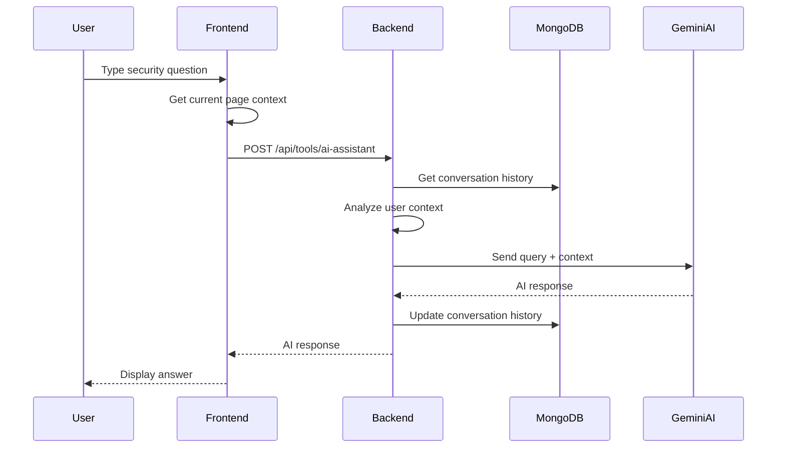

---

## 🎯 Activity Diagrams

### 1. User Registration Activity
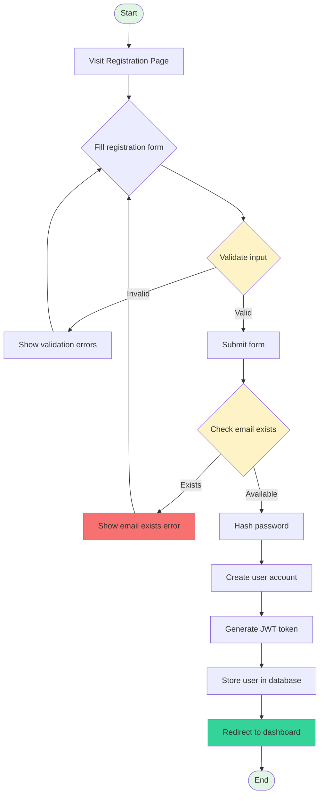

### 2. Security Tool Analysis Activity
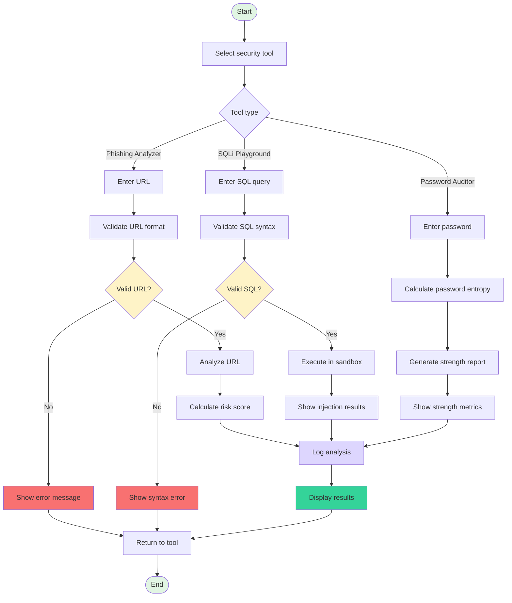

### 3. Quiz Taking Activity
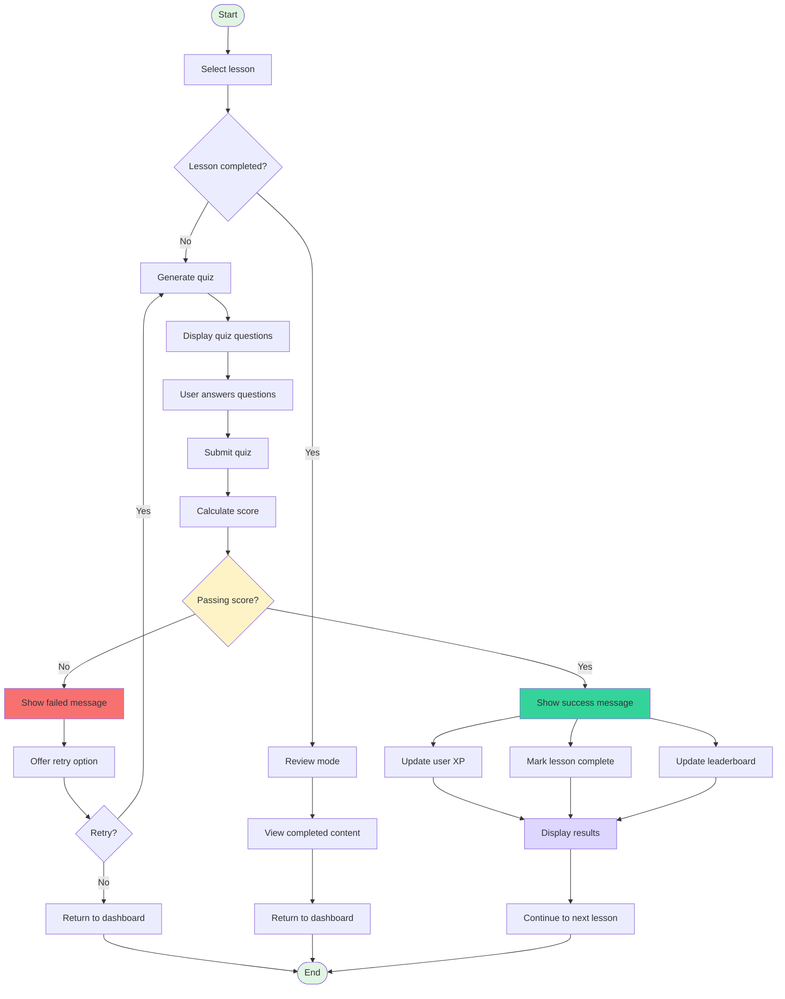

---

## 📚 Data Dictionary

### User Management Data

| Field Name | Data Type | Length | Constraints | Description | Example |
|------------|------------|----------|--------------|-------------|----------|
| user_id | ObjectId | 12 bytes | Primary Key, Auto-generated | Unique user identifier | 507f1f77bcf86cd799439011 |
| name | String | 100 chars | Required, Not null | User's full name | "John Doe" |
| email | String | 255 chars | Required, Unique, Not null | User's email address | "john@example.com" |
| password | String | 255 chars | Required, Bcrypt hashed | User's password (hashed) | "$2b$12$..." |
| role | String | 20 chars | Required, Enum: user/admin | User's role in system | "user" |
| xp | Integer | 4 bytes | Default: 0, Min: 0 | Experience points earned | 1250 |
| completed_lessons | Array | Variable | Optional | Array of completed lesson IDs | ["lesson_1", "lesson_2"] |
| daily_streak | Integer | 2 bytes | Default: 0, Min: 0 | Consecutive days active | 7 |
| organization | String | 100 chars | Optional | User's organization | "Mumbai University" |
| profile_picture | String | 500 chars | Optional | URL to profile image | "https://..." |
| created_at | Date | 8 bytes | Auto-generated | Account creation timestamp | 2024-03-05T10:30:00Z |
| last_login | Date | 8 bytes | Optional | Last login timestamp | 2024-03-05T09:15:00Z |

### Lesson Content Data

| Field Name | Data Type | Length | Constraints | Description | Example |
|------------|------------|----------|--------------|-------------|----------|
| lesson_id | String | 50 chars | Required, Unique | Lesson identifier | "lesson_1" |
| title | String | 200 chars | Required | Lesson title | "Introduction to Phishing" |
| content | String | Variable | Required | Lesson content (HTML/Markdown) | "<h1>Phishing...</h1>" |
| difficulty | String | 20 chars | Required, Enum: beginner/intermediate/advanced | Difficulty level | "beginner" |
| prerequisites | Array | Variable | Optional | Required lesson IDs | ["lesson_0"] |
| estimated_time | Integer | 2 bytes | Min: 5, Max: 300 | Estimated completion time (minutes) | 45 |
| learning_objectives | Array | Variable | Optional | Learning objectives | ["Identify phishing emails"] |
| is_active | Boolean | 1 byte | Default: true | Lesson availability | true |

### Security Log Data

| Field Name | Data Type | Length | Constraints | Description | Example |
|------------|------------|----------|--------------|-------------|----------|
| log_id | ObjectId | 12 bytes | Primary Key, Auto-generated | Unique log identifier | 507f1f77bcf86cd799439012 |
| user_id | ObjectId | 12 bytes | Foreign Key, Required | User who performed action | 507f1f77bcf86cd799439011 |
| tool_name | String | 50 chars | Required | Security tool used | "Phishing Analyzer" |
| input_data | String | 1000 chars | Required, PII redacted | Tool input (sanitized) | "http://example***.com" |
| risk_level | String | 20 chars | Required, Enum: low/medium/high/critical | Risk assessment | "medium" |
| result_summary | String | 500 chars | Required | Analysis result summary | "URL shows low risk indicators" |
| timestamp | Date | 8 bytes | Auto-generated | When action occurred | 2024-03-05T10:30:00Z |
| ip_address | String | 45 chars | Optional | User's IP address | "192.168.1.100" |

### Quiz Data

| Field Name | Data Type | Length | Constraints | Description | Example |
|------------|------------|----------|--------------|-------------|----------|
| quiz_id | String | 50 chars | Required, Unique | Quiz identifier | "quiz_lesson_1_001" |
| lesson_id | String | 50 chars | Foreign Key, Required | Associated lesson | "lesson_1" |
| questions | Array | Variable | Required | Quiz questions array | [{"question": "...", "options": [...]}] |
| passing_score | Integer | 2 bytes | Min: 0, Max: 100 | Minimum passing percentage | 70 |
| time_limit | Integer | 2 bytes | Min: 60, Max: 3600 | Time limit in seconds | 1800 |
| created_at | Date | 8 bytes | Auto-generated | Quiz creation timestamp | 2024-03-05T10:30:00Z |

### Authentication Token Data

| Field Name | Data Type | Length | Constraints | Description | Example |
|------------|------------|----------|--------------|-------------|----------|
| token_id | String | 255 chars | Primary Key, Unique | Token identifier | "tok_507f1f77bcf86cd799439011" |
| user_id | ObjectId | 12 bytes | Foreign Key, Required | Token owner | 507f1f77bcf86cd799439011 |
| issued_at | Date | 8 bytes | Auto-generated | Token issuance time | 2024-03-05T10:30:00Z |
| expires_at | Date | 8 bytes | Required | Token expiration time | 2024-03-08T10:30:00Z |
| token_type | String | 20 chars | Required, Enum: access/refresh | Token type | "access" |
| is_active | Boolean | 1 byte | Default: true | Token status | true |

### System Configuration Data

| Field Name | Data Type | Length | Constraints | Description | Example |
|------------|------------|----------|--------------|-------------|----------|
| setting_key | String | 100 chars | Primary Key, Unique | Configuration key | "MAX_LOGIN_ATTEMPTS" |
| setting_value | String | 1000 chars | Required | Configuration value | "5" |
| description | String | 500 chars | Optional | Setting description | "Maximum failed login attempts" |
| updated_at | Date | 8 bytes | Auto-generated | Last update timestamp | 2024-03-05T10:30:00Z |
| updated_by | ObjectId | 12 bytes | Foreign Key, Required | Admin who updated | 507f1f77bcf86cd799439099 |

---

## 🔒 Security Considerations in Data Design

### Data Protection Measures
1. **Password Hashing**: Bcrypt with salt rounds (minimum 12)
2. **PII Redaction**: Automatic masking in security logs
3. **Token Security**: JWT with short expiration (72 hours)
4. **Input Validation**: Pydantic models for all inputs
5. **Rate Limiting**: Built-in API throttling

### Privacy Controls
1. **Data Minimization**: Only collect necessary information
2. **User Consent**: Clear privacy policy and terms
3. **Data Retention**: Configurable log retention periods
4. **Access Control**: Role-based permissions
5. **Audit Trail**: Complete activity logging

### Compliance Features
1. **GDPR Compliance**: Right to delete/export data
2. **Educational Use**: Clear ethical usage guidelines
3. **Data Encryption**: TLS 1.3 for all communications
4. **Secure Storage**: Encrypted database connections
5. **Regular Audits**: Security log analysis and monitoring

---

*This comprehensive system design documentation provides the foundation for implementing, maintaining, and scaling the CyberSafe Nexus cybersecurity education platform while ensuring security, performance, and educational effectiveness.*
